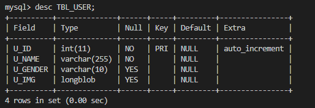

# 基于MySQL的增删改查
这是一个基于Linux平台，使用 C 语言编写的 MySQL 数据库交互程序，实现了一些基本的数据库操作（插入、查询、删除），以及读取和写入图片数据到 MySQL 数据库的功能。以下是对这个项目的描述和包含的技术的罗列：

### 项目描述：

1. **数据库操作：** 通过 MySQL C API 连接到 MySQL 数据库，实现了插入、查询和删除数据库表的操作。使用了 MySQL 的存储过程 `PROC_DELETE_USER` 进行用户删除操作。
2. **图片操作：** 通过文件 I/O，读取`./picture/pic1`图片数据并将其写入文件。同时，将图片数据以二进制形式存储到 MySQL 数据库中，以及从数据库中读取图片数据并保存于`./picture/pic2`。
3. **MySQL 链接与配置：** 使用 MySQL C API 初始化 MySQL 数据库句柄，并通过 `mysql_real_connect` 连接到 MySQL 数据库。在程序中设置了数据库的 IP、端口、用户名、密码等配置信息。
4. **错误处理：** 通过检查 MySQL 函数的返回值，对可能的错误进行处理，并输出相应的错误信息。

### 包含的技术：

1. **MySQL C API：** 使用 MySQL 提供的 C 语言 API 进行与 MySQL 数据库的交互，包括连接、查询、执行 SQL 语句等操作。
2. **文件 I/O：** 通过标准 C 文件 I/O 函数（`fopen`, `fclose`, `fread`, `fwrite`）实现对图片文件的读取和写入。
3. **存储过程：** 使用 MySQL 存储过程 `PROC_DELETE_USER` 进行用户删除操作，提高数据库操作的灵活性和安全性。
4. **错误处理：** 利用 MySQL 提供的错误处理机制，通过输出错误信息提高程序的健壮性。
5. **MySQL 数据库配置：** 在程序中设置了连接 MySQL 数据库所需的配置信息，包括数据库的 IP 地址、端口、用户名、密码等。
6. **数据绑定：** 使用 `mysql_stmt_bind_param` 和 `mysql_stmt_send_long_data` 等函数实现对二进制数据的绑定和发送。

这个项目展示了如何使用 C 语言与 MySQL 数据库进行交互，并且在其中结合了文件操作和存储过程的使用。
# 流程
## 一、MySQL相关配置
### 1. 安装 MySQL：

#### Ubuntu/Debian 系统：

```bash
sudo apt-get update
sudo apt-get install mysql-server
```

#### CentOS/RHEL 系统：

```bash
sudo yum install mysql-server
```
安装有问题参考一下博客：
https://blog.csdn.net/m0_70811813/article/details/131896997 和
https://zhuanlan.zhihu.com/p/623778183?utm_id=0

### 2. 启动 MySQL 服务：

#### Ubuntu/Debian 系统：

```bash
sudo systemctl start mysql
-- 查看运行状态
sudo systemctl status mysql
```

#### CentOS/RHEL 系统：

```bash
sudo systemctl start mysqld
-- 查看运行状态
sudo systemctl status mysqld
```

### 3. 运行 MySQL 安全性脚本（可选但推荐）：

```bash
sudo mysql_secure_installation
```

该脚本会提示你设置MySQL的root密码、删除匿名用户、禁止root远程登录等。按照提示进行操作。

### 4. 登录到 MySQL 控制台：

```bash
mysql -u root -p 
-输入密码
```

### 5. 创建用户和数据库：

```sql
CREATE DATABASE your_database_name;
CREATE USER 'your_user'@'localhost' IDENTIFIED BY 'your_password';
GRANT ALL PRIVILEGES ON your_database_name.* TO 'your_user'@'localhost';
FLUSH PRIVILEGES;
```

确保替换 `your_database_name`、`your_user` 和 `your_password` 为实际的数据库名、用户名和密码。如果允许来自任何主机的连接，可以使用 `'%'` 替代`localhost`。

**为用户分配权限：**
使用 GRANT 语句为用户分配适当的权限
```sql
GRANT ALL PRIVILEGES ON *.* TO 'your_user'@'%' WITH GRANT OPTION;
FLUSH PRIVILEGES;
```
- `ALL PRIVILEGES`: 赋予用户 your_user 所有权限。
- `*.*`: 表示对所有数据库的所有表授予权限。
- `'your_user'@'%'`: 用户 your_user 从任何主机都可以连接。
- `IDENTIFIED BY 'your_password'`: 设置用户 your_user 的密码，请将 'your_password' 替换为实际的密码。
- `WITH GRANT OPTION`: 允许用户 your_user 授予其拥有的权限给其他用户。

**查看当前所有用户和访问权限**:
```sql
SELECT user,host FROM mysql.user;
```
**在创建用户或更改密码时遇到 ERROR 1819** 跳转下一步。
### 6. 配置 MySQL 服务器：

#### 在修改MySQL配置文件[mysqld]部分添加或修改
- bind_address 0.0.0.0
- port=3306
- character-set-server=utf8
- default-storage-engine=innodb
##### Server-Ubuntu/Debian
```bash
sudo vim /etc/mysql/mysql.conf/mysqld.cnf 
```
##### Server-Centos/RHEL
```bash
sudo vim etc/my.cnf 
```
#### 如果在创建用户或更改密码时遇到 ERROR 1819，说明您的密码不符合当前密码策略的要求。
1. 使用符合要求的密码：
- 至少 8 个字符。
- 至少一个小写字母。
- 至少一个大写字母。
- 至少一个数字。
- 至少一个特殊字符
2. 禁用密码策略：
- 编辑 MySQL 配置文件，在 [mysqld] 部分添加或修改以下行：

```ini
validate_password=OFF
```
- 保存并关闭文件。
- 重启 MySQL 服务。（见下一步）
### 7. 重启 MySQL 服务以使更改生效：

#### Ubuntu/Debian 系统：

```bash
sudo systemctl restart mysql
```

#### CentOS/RHEL 系统：

```bash
sudo systemctl restart mysqld
```
### 8. 设置开机启动（可以不进行设置）
如果有需要的话我们可以将mysql设置为开机启动：
```bash
systemctl enable mysqld
systemctl daemon-reload
```

这些步骤提供了一个基本的 MySQL 配置。你还可以根据需求进一步调整配置，例如调整缓冲池、日志等参数。

请注意，确保在配置 MySQL 时考虑安全性，并在生产环境中采取适当的安全措施，例如限制远程访问、使用强密码等。

## 二、MySQL_dev相关配置
### 1.执行查找命令
```bash
find / -name mysql.h
```
无显示or未查找到，执行第二步
### 2.安装mysql头文件包
#### Ubuntu/Debian 系统：
```bash
sudo yum -y install mysql-devel
```
#### CentOS/RHEL 系统：
```bash
sudo sudo apt-get install libmysqlclient-dev
```
## 三、创建数据库
 
1. **登录到 MySQL 服务器：**

   ```bash
   mysql -u your_user -p
   ```

   输入 MySQL 的 your_user 用户密码以登录。

### 2. 数据库编程

```sql
-- 创建数据库 your_database_name
CREATE DATABASE IF NOT EXISTS your_database_name;
-- 使用数据库 your_database_name
USE your_database_name;
-- 创建表 TBL_USER
CREATE TABLE IF NOT EXISTS TBL_USER (
    U_ID INT AUTO_INCREMENT PRIMARY KEY,
    U_NAME VARCHAR(255) NOT NULL,
    U_GENDER VARCHAR(10),
    U_IMG BLOB
);
```
创建好的表如下所示：<br>

    

```sql
-- 创建 PROC_DELETE_USER 存储过程
DELIMITER //
CREATE PROCEDURE  IF NOT EXISTS PROC_DELETE_USER(IN username VARCHAR(255))
BEGIN
    DELETE FROM TBL_USER WHERE U_NAME = username;
END //
DELIMITER ;

-- 使用存储过程
CALL PROC_DELETE_USER('specific_username');

-- 设置默认数据库
USE lion_db;

```
- `CREATE DATABASE` 语句用于在数据库不存在时创建 `lion_db` 数据库。
- `USE lion_db;` 语句选择 `lion_db` 数据库以进行后续操作。
- `CREATE TABLE` 语句用于创建具有 `U_ID`、`U_NAME`、`U_GENDER` 和 `U_IMG`（假设 `U_IMG` 是二进制大对象，BLOB）列的 `TBL_USER` 表。
- `CREATE PROCEDURE` 语句用于创建 `PROC_DELETE_USER` 存储过程，该过程接受用户名作为输入，并从 `TBL_USER` 表中删除相应的用户。
- 最后，`USE lion_db;` 语句确保默认数据库设置为 `lion_db`。

修改表
```sql
ALTER TABLE your_table MODIFY COLUMN U_IMG LONGBLOB;
```
查看当前所有的数据库
```sql
SHOW DATABASES;
```
查看当前所有的表
```sql
SHOW TABLES;
```
查看指定表 your_table_name
```sql
DESCRIBE your_table_name;
```

## 四、编译与运行

```bash
# 编译
gcc -o crud crud.c  -I /usr/include/mysql/ -L /usr/lib64/mysql -lmysqlclient
# 运行
./crud
```
- `-I /usr/include/mysql/` 如不存在，需要安装mysql头文件包（流程的第二步）
- `-L /usr/lib64/mysql` 用于指定链接器查找MySQL库文件的路径，需要安装MySQL（流程的第一步）
如果找不到mysql可以使用以下命令
```bash
mysql_config --libs
```
- 其他问题
error while loading shared libraries: libmysqlclient.so.18: cannot open shared object file: No such file or directory
```bash
sudo ldconfig
find /usr/lib* /lib* -name 'libmysqlclient.so.*'
sudo ln -s /usr/lib64/mysql/libmysqlclient.so.20 /usr/lib64/mysql/libmysqlclient.so.18
# 再重新编译
gcc -o crud crud.c  -I /usr/include/mysql/ -L /usr/lib64/mysql -lmysqlclient
```

